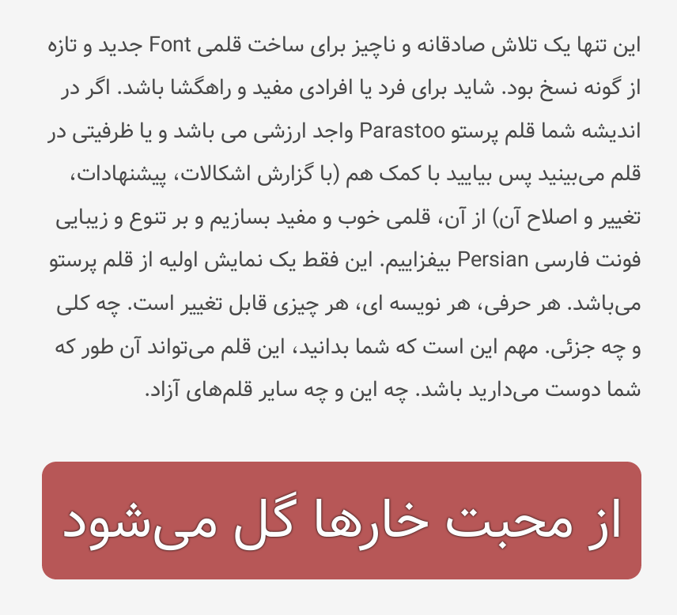

# Vazir-Font
A Persian (Farsi) Font

[](https://travis-ci.org/rastikerdar/vazir-font)
[](https://badge.fury.io/js/vazir-font)


<p dir="rtl">
فونت فارسی وزیر <br />

<p dir="rtl"><a href="http://rastikerdar.github.io/vazir-font/">نمایش فونت</a></p>
<p dir="rtl"><a href="https://github.com/rastikerdar/vazir-font/releases">صفحه دریافت (دانلود) بسته فونت شامل فایل های ttf,woff,eot</a></p> <br />

<p dir="rtl">متن نمونه:</p>

<p align="center">
    
</p>

<br>

<p dir="rtl"> با تشکر از برنامه  <a href="https://fontforge.github.io">FontForge</a></p>
<p dir="rtl"> بر مبنای فونت <a href="https://dejavu-fonts.github.io/">DejaVu Sans 2.35</a></p>

</p>
<p lang="fa" dir="rtl" align="right">
نسخه های بدون حروف لاتین یا تمام ارقام فارسی درون بسته فشرده موجود می‌باشد.
</p>
<h1 dir="rtl">
طریقه استفاده در صفحات وب:
</h1>

<p dir="rtl">
کد زیر را در قسمت style یا فایل css وارد نمایید:
</p>


```css
@font-face {
    font-family: Vazir;
    src: url('../fonts/Vazir-Black-FD.eot');
    src: url('../fonts/Vazir-Black-FD.eot?#iefix') format('embedded-opentype'),
	url('../fonts/Vazir-Black-FD.woff2') format('woff2'),
    url('../fonts/Vazir-Black-FD.woff') format('woff'),
    url('../fonts/Vazir-Black-FD.ttf') format('truetype');
    font-weight: 900;
	font-style: normal;
}
@font-face {
    font-family: Vazir;
    src: url('../fonts/Vazir-Bold-FD.eot');
    src: url('../fonts/Vazir-Bold-FD.eot?#iefix') format('embedded-opentype'),
	url('../fonts/Vazir-Bold-FD.woff2') format('woff2'),
    url('../fonts/Vazir-Bold-FD.woff') format('woff'),
    url('../fonts/Vazir-Bold-FD.ttf') format('truetype');
    font-weight: bold;
	font-style: normal;
}
@font-face {
    font-family: Vazir;
    src: url('../fonts/Vazir-Medium-FD.eot');
    src: url('../fonts/Vazir-Medium-FD.eot?#iefix') format('embedded-opentype'),
	url('../fonts/Vazir-Medium-FD.woff2') format('woff2'),
    url('../fonts/Vazir-Medium-FD.woff') format('woff'),
    url('../fonts/Vazir-Medium-FD.ttf') format('truetype');
    font-weight: 500;
	font-style: normal;
}
@font-face {
    font-family: Vazir;
    src: url('../fonts/Vazir-Light-FD.eot');
    src: url('../fonts/Vazir-Light-FD.eot?#iefix') format('embedded-opentype'),
	url('../fonts/Vazir-Light-FD.woff2') format('woff2'),
    url('../fonts/Vazir-Light-FD.woff') format('woff'),
    url('../fonts/Vazir-Light-FD.ttf') format('truetype');
    font-weight: 300;
	font-style: normal;
}
@font-face {
    font-family: Vazir;
    src: url('../fonts/Vazir-Thin-FD.eot');
    src: url('../fonts/Vazir-Thin-FD.eot?#iefix') format('embedded-opentype'),
	url('../fonts/Vazir-Thin-FD.woff2') format('woff2'),
    url('../fonts/Vazir-Thin-FD.woff') format('woff'),
    url('../fonts/Vazir-Thin-FD.ttf') format('truetype');
    font-weight: 200;
	font-style: normal;
}
@font-face {
    font-family: Vazir;
    src: url('../fonts/Vazir-FD.eot');
    src: url('../fonts/Vazir-FD.eot?#iefix') format('embedded-opentype'),
	url('../fonts/Vazir-FD.woff2') format('woff2'),
    url('../fonts/Vazir-FD.woff') format('woff'),
    url('../fonts/Vazir-FD.ttf') format('truetype');
    font-weight: normal;
	font-style: normal;
}
```

## Install

#### Download
Grab the [latest release](https://github.com/rastikerdar/vazir-font/releases/latest) file.

#### Bower
```
bower install vazir-font --save
```

#### npm
```
npm install vazir-font
```
Fonts will be copied to `node_modules/vazir-font/dist` directory

#### CDN
Link fonts from the [RawGit](https://rawgit.com) CDN:

```html
<link href="https://cdn.rawgit.com/rastikerdar/vazir-font/v[X.Y.Z]/dist/font-face.css" rel="stylesheet" type="text/css" />
```

Replace [X.Y.Z] with the latest version (e.g. 19.0.0) and integrate the font into your CSS:

```
font-family: 'Vazir', sans-serif;
```

#### Homebrew
You can install the font on macOS machines by tapping the caskroom/fonts repo:

```shell
brew tap caskroom/fonts
brew install font-vazir
```

#### Arch Linux
Arch user's could use [vazir-fonts](https://aur.archlinux.org/packages/vazir-fonts/) package from [AUR](https://aur.archlinux.org/) repository to install vazir font.
Use your favourite [AUR helper](https://wiki.archlinux.org/index.php/AUR_helpers) like pacaur or yaourt for installing package:

```shell
pacaur -S vazir-fonts
```
#### Ubuntu
An unofficial PPA is available for installing Vazir and other free Persian fonts. It only works on Ubuntu 18.04 and higher. Open a Terminal and enter these commands:
```shell
sudo add-apt-repository ppa:blacksuited/fonts
sudo apt install fonts-vazir
```
